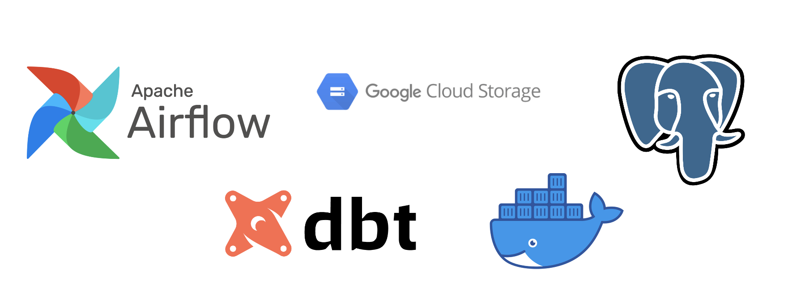

# 📌 Taskflow Orchestration with Airflow



> This is a project I worked on while learning about Airflow and task orchestration.
The goal of this project was to learn airflow and build a simple data backup application.

## 🚀 Features

- ✨ Use Airflow-provided PostgresToGCSOperator on a single table or set of tables to back up data to a GCS blob.
- 🔥 Created custom SQL Operator and GCS Hook to learn how to build custom extracting/loading functionality, inheriting from Airflow base classes.
- ⚡ Running DBT models using Airflow-provided DockerOperator
- 🎯 Running DBT models using custom-made DockerExecutorOperator that submits jobs to provisioned (hot) containers.

## 📦 Installation

```sh
# Clone the repository
git clone https://github.com/yourusername/project-name.git
cd project-name

# Install dependencies
npm install

# Run the project
npm start
```

## 📖 Usage

Provide examples or steps on how to use your project.

```sh
# Example command or API request
node app.js
```

## 🛠 Tech Stack

- 🖥️ GCP
- 📚 Airflow
- 🏗️ DBT
- 🚀 Docker

## 🙌 Acknowledgments

- Thanks to [Gary Clark and Xccelerated team for provided training](https://github.com/contributor1)
- Inspiration from [Project X](https://github.com/projectx)

---

⭐ **Don't forget to give this repo a star if you found it useful!** ⭐
